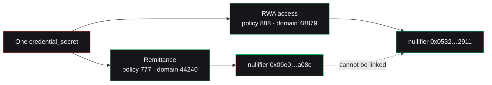

Nullis ships two example apps that share a single contract and a single circuit. They aren't toys glued on top — they're the proof of the hardest claim in the system: the **same credential** authorizes actions in both apps, yet is **unlinkable** between them.

## Two apps, one engine

<CardGroup cols={2}>
  <Card title="Remittance" icon="money-bill-transfer">
    `examples/remittance/` — a corridor policy (e.g. NG → UK) with an amount cap. A user proves corridor eligibility privately; the contract executes the exact transfer, once.
  </Card>
  <Card title="RWA access" icon="building-columns">
    `examples/rwa-access/` — an access-grant policy for a tokenized real-world asset. A user proves they're on the approved list; the contract grants access, once.
  </Card>
</CardGroup>

| | Remittance | RWA access |
| --- | --- | --- |
| Policy id | 777 | 888 |
| `action_type` | `transfer` | `access_grant` |
| `app_domain` | 44240 | 48879 |
| What's proven | corridor eligibility | approved-list membership |
| What executes | asset transfer | access grant |
| Nullifier | `0x09e0…436ba08c` | `0x0532…357f2911` |

Same engine, different policies, different `app_domain` — and therefore different, unlinkable nullifiers.

## Walkthrough — the remittance app

<Steps>
  <Step title="The app publishes a policy">
    ```json
    {
      "policy_id": 777,
      "version": 1,
      "action_type": "transfer",
      "asset": "USDC",
      "max_amount": 1000,
      "approved_root": "0x…",       // corridor-eligible commitments
      "app_domain": "remittance-ng-uk",
      "expiry": 1785000000
    }
    ```
    Hashed to `policy_hash` and registered on-chain (`PolicyPublished`).
  </Step>
  <Step title="A user builds a request + proof">
    The user holds a `credential_secret` whose commitment is in the corridor's approved root. `buildRequest` derives the canonical public inputs; Noir + Barretenberg generate the proof.

    ```ts
    const req = buildRequest({
      policyId: 777n, policyHash, policyVersion: 1, approvedRoot,
      appDomainHash, policyExpiry, networkId, nullisContract,
      credentialSecret,
      action: { actionType: 1, recipient, amount: 100n, asset, consumingContract, intentNonce },
    });
    ```
  </Step>
  <Step title="verify_and_execute — one call">
    ```ts
    const receipt = await nullis.verifyAndExecute({
      policyId: 777n, publicInputs: req.publicInputs, proof, action: req.action,
    });
    // → result: VERIFIED, executed: true — 100 USDC moved, identity never revealed
    ```
  </Step>
</Steps>

The **RWA access** app is the same shape with `action_type: "access_grant"` and a different approved root — proving membership in an asset's allowlist instead of a corridor.

## Run the unlinkability proof

The load-bearing example. One credential, two apps, two unlinkable nullifiers:

```bash
npm run build -w @nullis/core -w @nullis/sdk -w @nullis/issuer
node examples/unlinkability.mjs
```



Sample output (captured in `artifacts/demo-results.json`):

```json
{
  "credentialCommitment": "0x17b1b911…e0c4ab09",
  "apps": {
    "remittance": { "policyId": "777", "appDomainHash": "44240", "nullifier": "0x09e0…436ba08c" },
    "rwaAccess":  { "policyId": "888", "appDomainHash": "48879", "nullifier": "0x0532…357f2911" }
  },
  "unlinkable": true
}
```

<Check>
  The same `credentialCommitment` produces two different nullifiers. There is no shared value an observer could use to link the remittance user to the RWA-access user — at the proof/nullifier layer. See [Unlinkability](/crypto/unlinkability) for the scope of that claim.
</Check>

## The evidence artifacts

The repo carries a full, reproducible evidence package:

| Artifact | What it holds |
| --- | --- |
| `README.md` · `EVIDENCE.md` | The reviewer-grade walkthrough and the real-vs-mocked line |
| `SECURITY.md` · `BENCHMARKS.md` | Threat model and measured numbers |
| `examples/remittance/` · `examples/rwa-access/` | The two apps above |
| `examples/unlinkability.mjs` | The cross-app unlinkability proof |
| `artifacts/testnet-transactions.json` | Every live testnet transaction |
| `artifacts/demo-results.json` · `submission-evidence.json` | Demo results and the submission manifest |

<CardGroup cols={2}>
  <Card title="See the live evidence" icon="clipboard-check" href="/evidence/testnet">
    Every claim as a real testnet transaction.
  </Card>
  <Card title="The SDK" icon="code" href="/build/sdk">
    The one-line `verifyAndExecute` these apps call.
  </Card>
</CardGroup>
