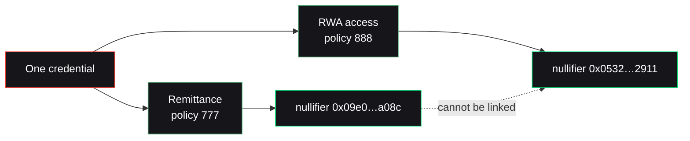

Nullis ships two example apps that share a single contract and circuit. They exist to prove the hardest claim: the **same credential** is unlinkable across different apps.

## Two apps, one engine

<CardGroup cols={2}>
  <Card title="Remittance" icon="money-bill-transfer">
    `examples/remittance/` — a corridor policy (e.g. NG → UK) with an amount cap. A user proves corridor eligibility privately; the contract executes the exact transfer.
  </Card>
  <Card title="RWA access" icon="building-columns">
    `examples/rwa-access/` — an access-grant policy for a tokenized real-world asset. A user proves they're on the approved list; the contract grants access.
  </Card>
</CardGroup>

Same engine, different policies, different `app_domain` — and therefore different, unlinkable nullifiers.

## Run the unlinkability proof

```bash
npm run build -w @nullis/core -w @nullis/sdk -w @nullis/issuer
node examples/unlinkability.mjs
```



The output (captured in `artifacts/demo-results.json`) shows the same credential producing two different nullifiers — cryptographically unlinkable at the proof/nullifier layer.

## The evidence artifacts

The repo works toward a full evidence package, all reproducible:

| Artifact | What it holds |
| --- | --- |
| `README.md` · `EVIDENCE.md` | The reviewer-grade walkthrough and the real-vs-mocked line |
| `SECURITY.md` · `BENCHMARKS.md` | Threat model and measured numbers |
| `examples/remittance/` · `examples/rwa-access/` | The two apps |
| `artifacts/` · `submission-evidence.json` | Live testnet transactions and demo results |

<Card title="See the live evidence" icon="clipboard-check" href="/evidence/testnet">
  Every claim as a real testnet transaction.
</Card>
