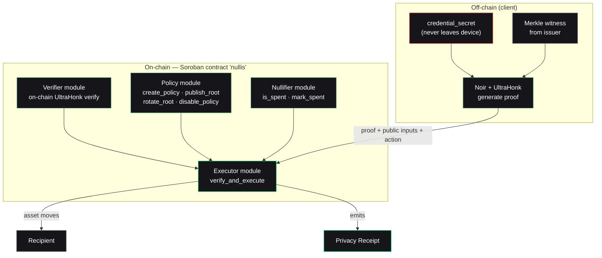

Nullis is **one modular Soroban contract**, not four deploy units. Splitting the protocol into separate contracts would only add cross-contract calls and bug surface. Internally, four modules cooperate behind a single entrypoint.

## The five layers

<CardGroup cols={2}>
  <Card title="1 · The circuit" icon="microchip">
    A Noir circuit proves, in zero knowledge: possession of a credential secret, membership of its commitment in the approved root, correct nullifier derivation, and binding to the exact action.
  </Card>
  <Card title="2 · The issuer" icon="stamp">
    Builds the approved-credential Merkle tree, issues membership witnesses, and rotates the root to revoke. (v0 reference issuer — no real KYC.)
  </Card>
  <Card title="3 · The contract" icon="file-contract">
    One Soroban contract that registers policies, verifies proofs on-chain, prevents replay, and executes the bound action atomically.
  </Card>
  <Card title="4 · The SDK & CLI" icon="terminal">
    `@nullis/sdk` submits `verify_and_execute` in one call; `@nullis/cli` validates policy manifests and renders receipts.
  </Card>
</CardGroup>

And the fifth: **the Privacy Receipt** — the inspectable artifact emitted after every decision, success and rejection alike.

## System diagram

## The contract modules

| Module | Responsibility | Functions |
| --- | --- | --- |
| **Policy** | Policy registry, versioning, root rotation | `create_policy`, `publish_root`, `rotate_root`, `disable_policy`, `get_policy` |
| **Nullifier** | Replay prevention | `is_spent`, `mark_spent` |
| **Verifier** | On-chain UltraHonk proof verification | `verify` |
| **Executor** | The core primitive | `verify_and_execute` |

## Canonical events

Every decision emits typed events, so the whole flow is inspectable from the ledger:

`PolicyPublished` · `RootRotated` · `ProofVerified` · `ActionExecuted` · `ActionRejected(reason)` · `ReplayBlocked` · `ReceiptEmitted`

## The execution adapter

v0 uses an **escrow model**: the contract holds test tokens and releases `contract balance → recipient` on success. This is a **reference execution adapter**, not the final design — the production path is an authorized transfer (`sender → recipient` in the same transaction).

<Note>
  The escrow adapter is deliberately labeled and disclosed. See the [honesty table](/evidence/honesty) for what is real vs. what is a reference implementation.
</Note>

<Card title="Next: the atomic primitive" icon="bolt" href="/concepts/verify-and-execute">
  Walk `verify_and_execute` step by step — the exact order of checks.
</Card>
