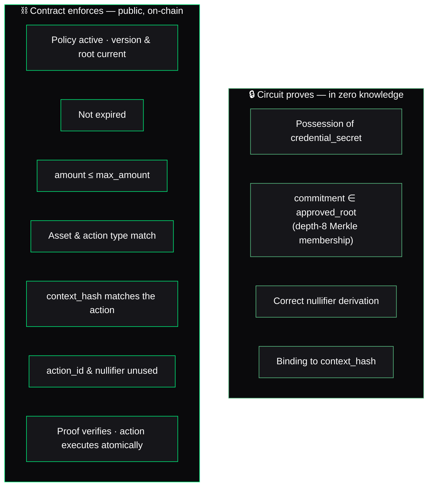
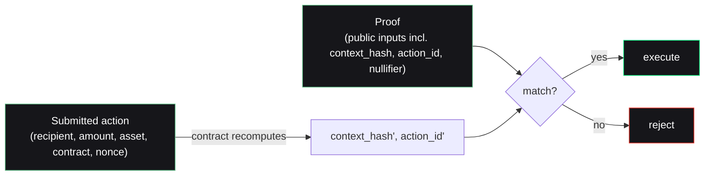

This is the single most important rule in Nullis, and the easiest thing for a technical reviewer to check. Get it wrong and the whole system is suspect; get it right and every claim is trustworthy.

> Privacy-critical statements live in the **circuit**. Already-public policy parameters are enforced by the **contract**. Never attribute a check to the circuit that the contract performs, or vice versa.

## The split

## Why the split is drawn here

The circuit only needs to prove the things that must stay **private**: that the prover holds a real credential, that this credential is in the approved set, and that they derived their nullifier and bound it to this exact action — all without revealing the secret or the identity.

Everything else is **already public**: the max amount, the asset, the expiry, whether the policy is active. There is no privacy value in proving them in-circuit, and doing so would only make the circuit larger and slower. The contract checks them cheaply, in the clear, where anyone auditing the ledger can see the same values.

<Warning>
  A common mistake in ZK-finance projects is claiming the circuit enforces the amount limit or the recipient. In Nullis it does **not** — the contract does. The circuit binds the proof to a `context_hash`; the contract independently recomputes that hash from the submitted action and checks it. This is what makes the proof-to-action binding trustworthy.
</Warning>

## How the two halves connect

The proof binds to the action via `action_id`, which is folded into the nullifier. The contract independently recomputes `context_hash` and `action_id` from the submitted action and checks they match the proof's public inputs.

Neither half trusts the other blindly: the circuit proves the private facts, and the contract re-derives the public binding from the raw action it is about to execute.

<Card title="Next: the Privacy Receipt" icon="receipt" href="/concepts/privacy-receipt">
  The inspectable artifact every decision emits — success and rejection alike.
</Card>
