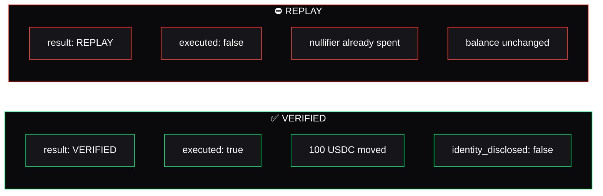

After **every** decision, `verify_and_execute` emits a **Privacy Receipt**. Not just on success — on rejection too. A blocked replay, a stale-version proof, a changed recipient: each leaves a receipt that says exactly what happened and what did not.

<Info>
  Success and failure both leave inspectable artifacts. That duality is the whole point: a system you can trust is one where the *rejections* are as legible as the successes.
</Info>

## What a receipt contains

A receipt records the decision and the action context — and, by design, **nothing that identifies the person**:

| Field | Meaning |
| --- | --- |
| `result` | `VERIFIED`, `REPLAY`, `REVOKED`, or a rejection reason |
| `executed` | Whether the asset actually moved |
| `policy_id` / `version` | Which policy and version decided this |
| `action_type` / `amount` / `asset` | The exact action that was authorized |
| `nullifier` | The one-time, domain-separated marker for this proof |
| `identity_disclosed` | Always `false` — no identity was revealed |
| `cross_app_identifier` | Always `false` — nothing linkable across apps |
| `ledger` | The ledger the decision was recorded at |

## Success vs. rejection

The two receipts above come from the **same proof**. The first submission verifies and moves 100 USDC. Replaying the exact same proof — the same nullifier — produces the second receipt: `REPLAY`, `executed: false`, balance unchanged. Same input, opposite outcome, both inspectable.

## Why this matters for trust

A system that only shows you its successes is asking you to trust it. Nullis shows you its **rejections** — with reasons — so you don't have to. Revoked, replayed, changed recipient, stale version: each is a first-class, on-chain, readable event.

<Card title="See real receipts on-chain" icon="cube" href="/evidence/testnet">
  The verified payment and the blocked replay, as live testnet transactions.
</Card>
