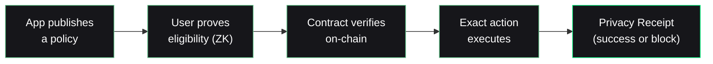

Stellar is built for real-world money: stablecoins, remittances, cross-border payments, tokenized assets. Real-world finance has a hard conflict at its core:

> Apps must know a user is **allowed** to act. Users should not have to surrender permanent identity data for temporary financial actions.

## The human version

Amina wants to send money home. The transfer takes seconds — but the payment app asks her to upload a passport that may sit in its database for years.

A password can be changed after a breach. **A passport cannot.**

## Two bad extremes

Today, teams pick one of two losing options:

<CardGroup cols={2}>
  <Card title="Public compliance" icon="id-card">
    KYC everything, store identity documents, reveal far more than the transaction requires. One breach away from permanent harm.
  </Card>
  <Card title="Unregulated privacy" icon="mask">
    Mixers and anonymity pools that institutions can't touch — because there's no way to prove *anyone* was allowed to do *anything*.
  </Card>
</CardGroup>

## The missing middle

Nullis is a **policy-as-code execution layer**. The app publishes what it requires. The user proves they satisfy it — cryptographically, without revealing who they are. The chain verifies the proof and executes exactly the action that was authorized: this recipient, this amount, this asset, this network, **once**.

Not "proof-only" — **proof-to-action, atomically**. The proof and the payment are one transaction. There is no window where a proof is valid but the action hasn't been checked, or vice versa.

## No reusable tracking identifier

A reusable credential must not become a tracking beacon. Nullis **domain-separates** nullifiers: the same credential produces different, unlinkable nullifiers in different apps.

Reusable credentials, without a reusable identifier. See [Unlinkability](/crypto/unlinkability).

<Note>
  Nullis scopes its privacy claim precisely. The proof and nullifier layer are unlinkable. Wallet addresses, funding sources, IPs, and timing can still correlate users — Nullis never overclaims beyond the artifact layer. See the [honesty table](/evidence/honesty).
</Note>
