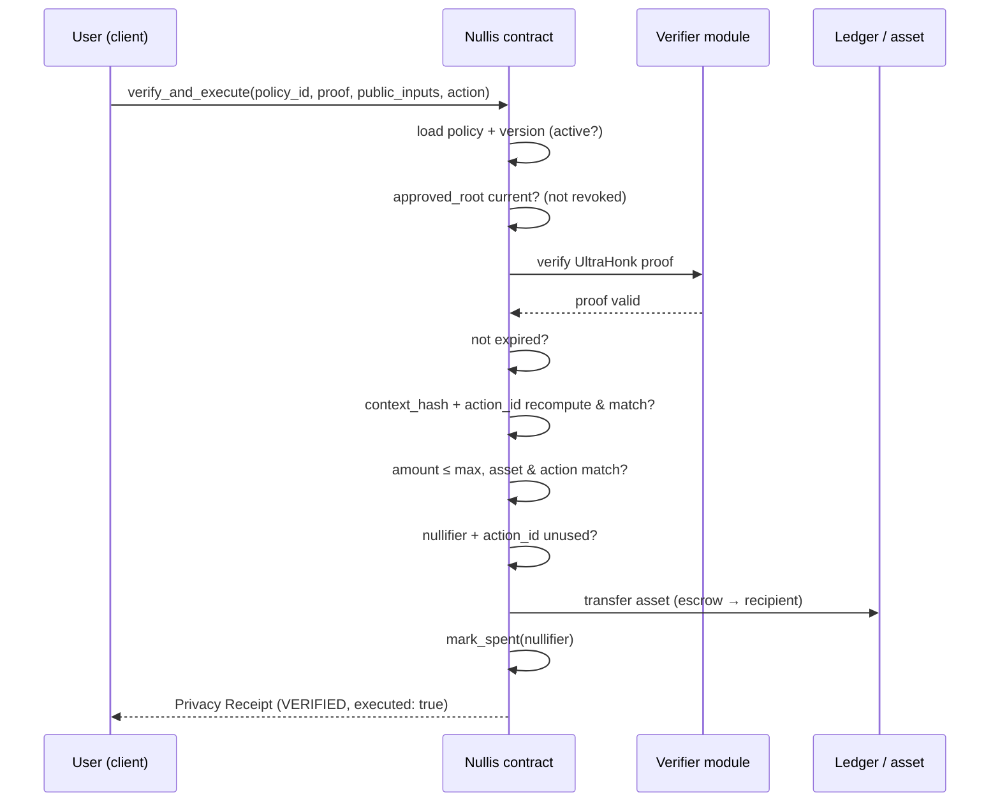
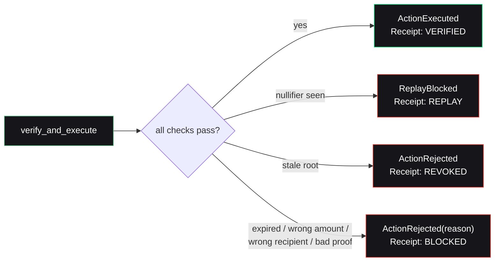

One atomic call is the entire product. It is **proof-to-action, never proof-only**:

```ts
await nullis.verifyAndExecute({ policyId, proof, publicInputs, action });
```

Verification and execution are one step. There is no window where a proof is accepted but the action is unchecked, and none where the action runs without a verified proof.

## The exact order of checks

The contract runs these in order, and stops at the first failure — emitting an `ActionRejected(reason)` and a Privacy Receipt:

<Steps>
  <Step title="Load the active policy + version">
    Fetch the policy by `policy_id`. Reject if disabled.
  </Step>
  <Step title="Check the approved root & revocation state">
    The proof's `approved_root` must match the policy's current root. Stale-version proofs are rejected — this is how [revocation](/crypto/revocation) works.
  </Step>
  <Step title="Verify the ZK proof on-chain">
    Run the UltraHonk verifier against the submitted proof and public inputs. This is real on-chain zero-knowledge verification.
  </Step>
  <Step title="Check expiry">
    Reject if the policy has expired.
  </Step>
  <Step title="Check the action context">
    Recompute `context_hash` and `action_id` from the submitted action and confirm they match the proof's public inputs — recipient, amount, asset, consuming contract, and network must all line up.
  </Step>
  <Step title="Check amount and asset">
    `amount ≤ max_amount`, and the asset and action type must match the policy.
  </Step>
  <Step title="Check the nullifier and action_id are unused">
    If either was seen before, this is a replay → `ReplayBlocked`.
  </Step>
  <Step title="Execute atomically">
    Move the asset (escrow → recipient in v0), mark the nullifier spent, and emit the Privacy Receipt.
  </Step>
</Steps>

## Sequence diagram



## When any check fails

The contract does **not** silently drop the transaction. It emits a typed rejection and a Privacy Receipt describing exactly what happened:



<Info>
  The nullifier binds `intent_nonce` into `action_id`, and `action_id` is consumed on-chain. A genuinely new payment requires a new intent nonce **and** a new proof — you cannot reuse a proof for a second payment.
</Info>

<Card title="Next: claim-safety" icon="shield-halved" href="/concepts/claim-safety">
  Which of these checks the circuit proves, and which the contract enforces — the #1 rule.
</Card>
