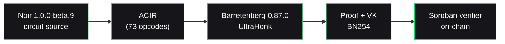

The Nullis circuit is written in [Noir](https://noir-lang.org) and proven with [Barretenberg](https://github.com/AztecProtocol/barretenberg)'s UltraHonk backend. It is deliberately small — everything that does **not** need to be private is left to the [contract](/concepts/claim-safety).

## What the circuit proves

In zero knowledge, from a private `credential_secret` and a Merkle witness:

<CardGroup cols={2}>
  <Card title="Possession" icon="fingerprint">
    The prover holds a `credential_secret` whose commitment is `Poseidon(credential_secret)`.
  </Card>
  <Card title="Membership" icon="sitemap">
    That commitment is a leaf in the policy's `approved_root` — a depth-8 Merkle tree.
  </Card>
  <Card title="Nullifier" icon="ban">
    The nullifier is derived correctly: `Poseidon(credential_secret, policy_id, app_domain, action_id)`.
  </Card>
  <Card title="Binding" icon="link">
    The proof is bound to a specific `context_hash`, tying it to one exact action.
  </Card>
</CardGroup>

The secret never leaves the prover's machine. The verifier — the Soroban contract — learns only that these statements hold.

## The numbers

Measured, not estimated. Circuit size from `bb gates`; timings on Apple Silicon.

<CardGroup cols={3}>
  <Card title="1,540 gates" icon="microchip">
    UltraHonk circuit size · 73 ACIR opcodes
  </Card>
  <Card title="~0.27 s" icon="gauge-high">
    `bb prove` — client-side, off-chain
  </Card>
  <Card title="~0.6 s" icon="clock">
    `nargo execute` (witness generation)
  </Card>
</CardGroup>

## Artifacts

| Artifact | Size |
| --- | --- |
| Proof | 14,592 bytes (456 field elements) |
| Public inputs | 160 bytes (5 field elements) |
| Verification key | 1,760 bytes |
| Contract wasm (real verifier) | 44,957 bytes |

## The stack



## Soundness

The circuit is tested for soundness — a valid member is accepted, and forgery attempts are rejected:

```bash
cd circuits/nullis && nargo test
```

A **non-member** secret, a **tampered Merkle path**, and a **wrong nullifier** are each rejected. You cannot produce a proof without a genuine witness.

<Info>
  On-chain, a **tampered proof** and a **tampered public input** are also rejected — verified by `cargo test -p nullis-contract`, which runs a real UltraHonk proof through the deployed verifier and confirms tampering fails.
</Info>

## Why Noir / UltraHonk

Nullis committed to **Noir / UltraHonk** at Phase 0 and never thrashed the stack. Circom/Groth16 was the fallback only on a hard UltraHonk blocker — which never materialized. Stack-thrashing is the real time-sink in ZK projects; committing early and once was a deliberate engineering decision.

<Card title="Next: unlinkability" icon="user-secret" href="/crypto/unlinkability">
  How one credential stays unlinkable across many apps.
</Card>
