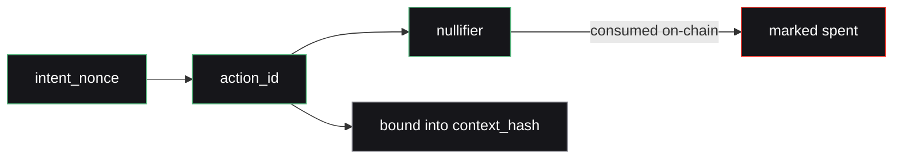

Every value in Nullis is derived with the same hash, over ordered fields, in a fixed structure. These structures are consensus-critical: they are computed identically on-chain (Rust), off-chain (TypeScript), and in the Noir circuit.

## Hash function

<Card title="Poseidon2 over BN254" icon="hashtag">
  Nullis uses **Poseidon / Poseidon2** on the BN254 curve — the Stellar Protocol 25/26 host functions. No other hash is substituted anywhere in the system.
</Card>

<Warning>
  **Never hash raw JSON.** Field order and whitespace make JSON non-canonical. Every hash below is computed over ordered fields only — the structures are fixed and must not be reordered or extended casually.
</Warning>

## The canonical structures

```txt
commitment   = Poseidon(credential_secret)

policy_hash  = Poseidon(policy_id, version, action_type, asset,
                        max_amount, approved_root, app_domain_hash, expiry)

context_hash = Poseidon(network_id, nullis_contract, consuming_contract,
                        policy_id, policy_version, action_type, recipient,
                        amount, asset, intent_nonce, expiry)

action_id    = Poseidon(consuming_contract, policy_id, policy_version,
                        action_type, recipient, amount, asset, intent_nonce)

nullifier    = Poseidon(credential_secret, policy_id, app_domain, action_id)
```

## What each one does

<AccordionGroup>
  <Accordion title="commitment" icon="fingerprint">
    `Poseidon(credential_secret)`. The public commitment to a private secret. The issuer adds commitments to the approved-root Merkle tree; the circuit proves membership without revealing the secret.
  </Accordion>
  <Accordion title="policy_hash" icon="file-lock">
    Binds every consensus-critical policy parameter into one hash, registered on-chain. Any change to the asset, limit, root, or expiry changes the hash — you cannot quietly alter a published policy.
  </Accordion>
  <Accordion title="context_hash" icon="link">
    Binds a proof to **one exact action** — network, both contracts, the policy version, and every field of the payment. The circuit binds to it; the contract recomputes it from the submitted action and checks the match.
  </Accordion>
  <Accordion title="action_id" icon="key">
    One application-created authorization intent, carrying the `intent_nonce`. Consumed on-chain to prevent replay.
  </Accordion>
  <Accordion title="nullifier" icon="ban">
    `Poseidon(credential_secret, policy_id, app_domain, action_id)`. Domain-separated and cross-app unlinkable. Consumed on-chain so the same proof can never be spent twice. The `app_domain` term is what makes it [unlinkable across apps](/crypto/unlinkability).
  </Accordion>
</AccordionGroup>

## Replay semantics



The `intent_nonce` is bound into `action_id` and consumed on-chain — it is **never** a free value feeding only the nullifier. A genuinely new payment requires a new intent nonce **and** a new proof.

## The cross-implementation guarantee

The load-bearing property of the whole system: the same canonical hashes are produced on-chain (Rust / `soroban-poseidon`), off-chain (TypeScript / `@nullis/core`), **and** in the Noir circuit. A single golden-vector file (`test-vectors.json`) is asserted by both Rust and TypeScript, and `nargo execute` cross-validates that Noir's Poseidon2 is identical.

<Check>
  Because all three implementations agree byte-for-byte, the ZK layer cannot silently diverge from the contract. See [Evidence → tests](/evidence/testnet#tests).
</Check>
