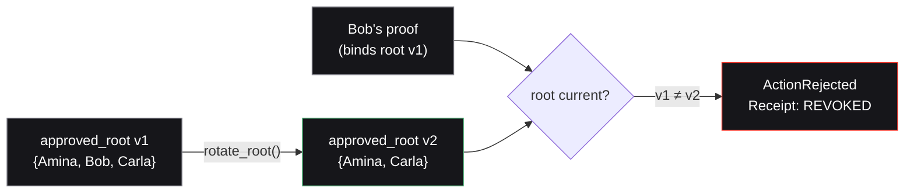
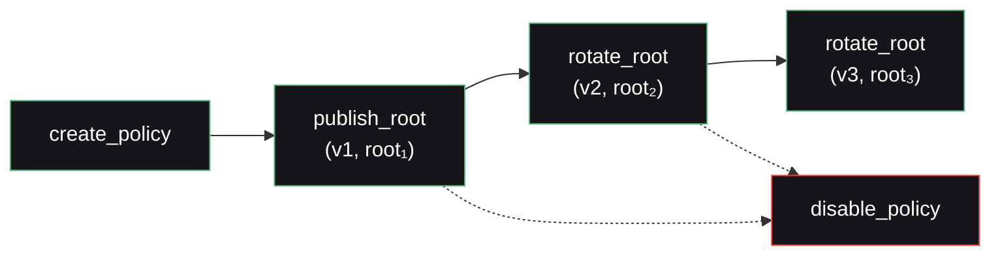
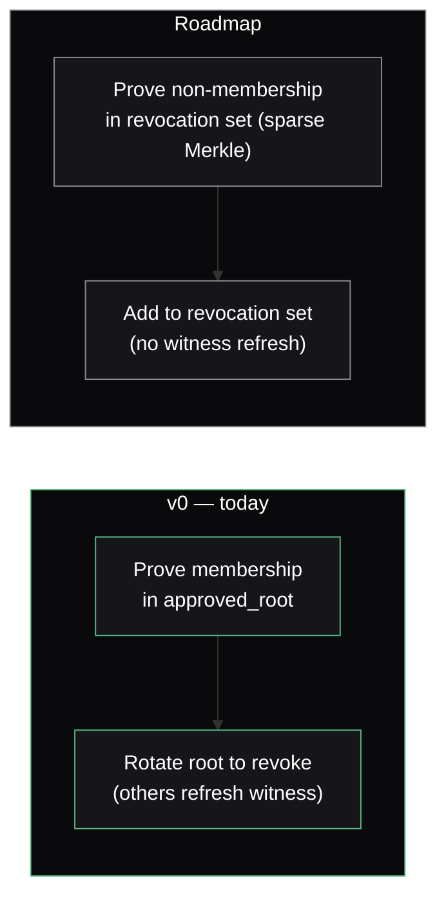

Access must be revocable. In Nullis, revocation happens by **rotating the approved root** and bumping the policy version. Stale-version proofs are then rejected on-chain — without the contract ever learning *whose* access was revoked.

## How it works

The issuer publishes a new root that omits the revoked credential and bumps the version. A proof that binds the old root no longer matches the policy's current root, so `verify_and_execute` rejects it and emits a `REVOKED` receipt.

## The policy lifecycle

Revocation is one move in a small, explicit lifecycle — all handled by the Policy module of the contract:

| Function | Effect | Event |
| --- | --- | --- |
| `create_policy` | Register a policy + its first root and version | `PolicyPublished` |
| `publish_root` | Set the approved root for a version | `PolicyPublished` |
| `rotate_root` | Publish a new root, bump the version — **this is revocation** | `RootRotated` |
| `disable_policy` | Stop all execution under a policy | — |

## A worked example

<Steps>
  <Step title="Before — v1">
    Policy 1001 is active at version 1 with `approved_root = root₁`, which includes Bob's commitment. Bob can prove membership and transact.
  </Step>
  <Step title="Revoke — rotate to v2">
    The issuer rebuilds the tree **without** Bob, computes `root₂`, and calls `rotate_root(1001, root₂)`. The policy is now at version 2. `RootRotated` is emitted.
  </Step>
  <Step title="After — Bob is blocked">
    Bob's existing proof binds `root₁` and `policy_version: 1`. The contract checks the proof's root against the policy's current root (`root₂`, v2) — they don't match. Result: `ActionRejected`, receipt `REVOKED`, nothing executes. Amina and Carla, still in `root₂`, are unaffected.
  </Step>
</Steps>

## The honest trade-off

<Warning>
  Root rotation invalidates existing Merkle witnesses. When the root rotates, **every still-approved user must refresh their membership path** to keep proving — because the tree changed shape. This is a real operational cost, and Nullis discloses it rather than hiding it.
</Warning>

This is the deliberate v0 choice: it is simple, on-chain-verifiable, and correct. It trades a witness-refresh cost for a design a reviewer can fully audit today.

## The roadmap path — in-circuit non-membership

The roadmap replaces "prove membership in an approved set" with "prove **non-membership** in a revocation set", using a sparse Merkle tree. The circuit itself proves a credential is *not* revoked, so honest users never have to refresh witnesses when someone else is removed.

<Note>
  In-circuit non-membership is a **roadmap item**. Nullis does not claim it until it ships stably. What runs today is root rotation with versioning — and the negative suite proves stale-version proofs are rejected on-chain.
</Note>

## What's tested

The negative suite exercises the whole revocation surface directly:

<CardGroup cols={3}>
  <Card title="Stale-root blocked" icon="ban">
    A proof binding an old root is rejected → `REVOKED`.
  </Card>
  <Card title="Disabled policy blocked" icon="ban">
    `disable_policy` stops all execution.
  </Card>
  <Card title="Expired policy blocked" icon="ban">
    Past-expiry proofs are rejected.
  </Card>
</CardGroup>

<Card title="See it in the evidence" icon="clipboard-check" href="/evidence/testnet">
  The full negative suite, green in CI.
</Card>
