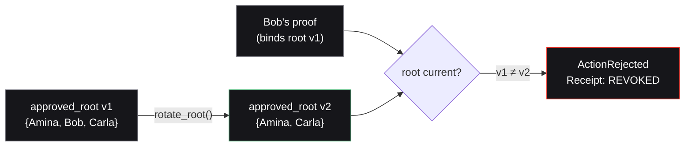

Access must be revocable. In Nullis, revocation happens by **rotating the approved root** and bumping the policy version. Stale-version proofs are then rejected on-chain — without the contract ever knowing whose access was revoked.

## How it works

The issuer publishes a new root that omits the revoked credential and bumps the version. A proof that binds the old root no longer matches the policy's current root, so `verify_and_execute` rejects it and emits a `REVOKED` receipt.

## The honest trade-off

<Warning>
  Root rotation invalidates existing Merkle witnesses. When the root rotates, **active users must refresh their membership paths** to keep proving. This is a real cost, and Nullis discloses it rather than hiding it.
</Warning>

This is the deliberate v0 choice: it is simple, on-chain-verifiable, and correct. The alternative — in-circuit non-membership — avoids the witness-refresh cost but is more complex.

## The roadmap path

The roadmap path is **in-circuit sparse-Merkle non-membership**: the circuit itself proves a credential is *not* in a revocation set, so revocation doesn't force honest users to refresh witnesses.

<Note>
  In-circuit non-membership is a roadmap item. Nullis does **not** claim it until it ships stably. What runs today is root rotation with versioning — and the [negative test suite](/evidence/testnet#tests) proves stale-version proofs are rejected on-chain.
</Note>

## What's tested

The negative suite includes the revocation path directly:

- **Stale-root (revoked) blocked** — a proof binding an old root is rejected.
- **Disabled policy blocked** — `disable_policy` stops all execution.
- **Expired policy blocked** — past-expiry proofs are rejected.

<Card title="See it in the evidence" icon="clipboard-check" href="/evidence/testnet">
  The full negative suite, green in CI.
</Card>
