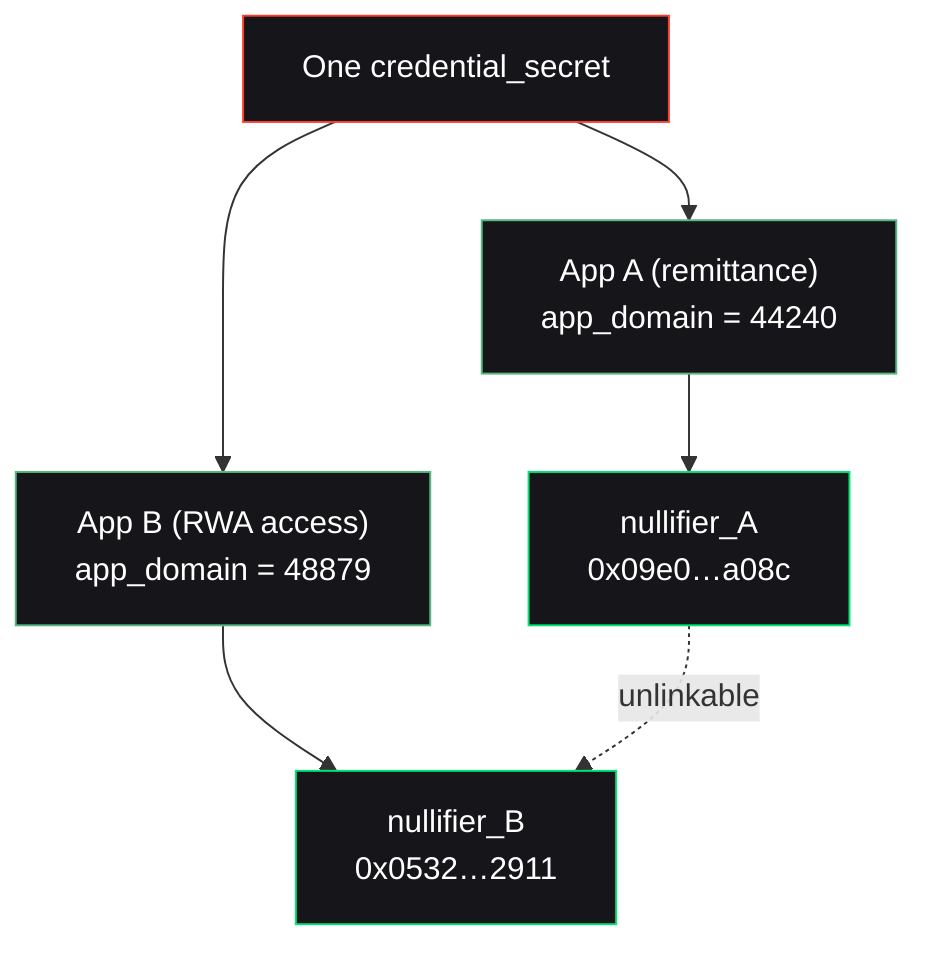

A reusable credential is convenient — and dangerous. If the same credential produced the same on-chain marker everywhere, it would become a tracking beacon: link a user's activity across every app that uses it.

Nullis prevents this by **domain-separating** the nullifier.

## The mechanism

The nullifier folds in an `app_domain` term:

```txt
nullifier = Poseidon(credential_secret, policy_id, app_domain, action_id)
```

Change the app, change the `app_domain`, change the nullifier — even for the identical credential. The `app_domain_hash` is a domain separator that makes one credential unlinkable across apps.



## Proven, not asserted

This is a real, reproducible result — the same credential used in the remittance app and the RWA-access app yields two different nullifiers:

```bash
npm run build -w @nullis/core -w @nullis/sdk -w @nullis/issuer
node examples/unlinkability.mjs
```

| App | Policy | app_domain | Nullifier |
| --- | --- | --- | --- |
| Remittance | 777 | 44240 | `0x09e01e5e…436ba08c` |
| RWA access | 888 | 48879 | `0x0532e4a7…357f2911` |

Two apps, one engine, cryptographically unlinkable at the proof and nullifier layer.

## The scope of the claim

<Warning>
  Unlinkability is scoped **precisely**. The same credential yields different nullifiers per app, unlinkable *at the proof and nullifier layer*. Wallet addresses, funding sources, IPs, and timing can still correlate users. Nullis never overclaims beyond the artifact layer.
</Warning>

This precision is itself a feature: Nullis tells you exactly where its privacy guarantee ends, so you can reason about the rest of your stack honestly.

<Card title="Next: revocation" icon="rotate" href="/crypto/revocation">
  How access is revoked without touching anyone's identity.
</Card>
