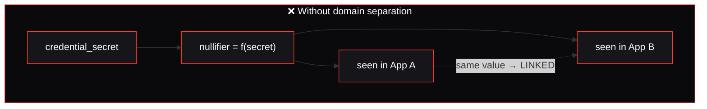
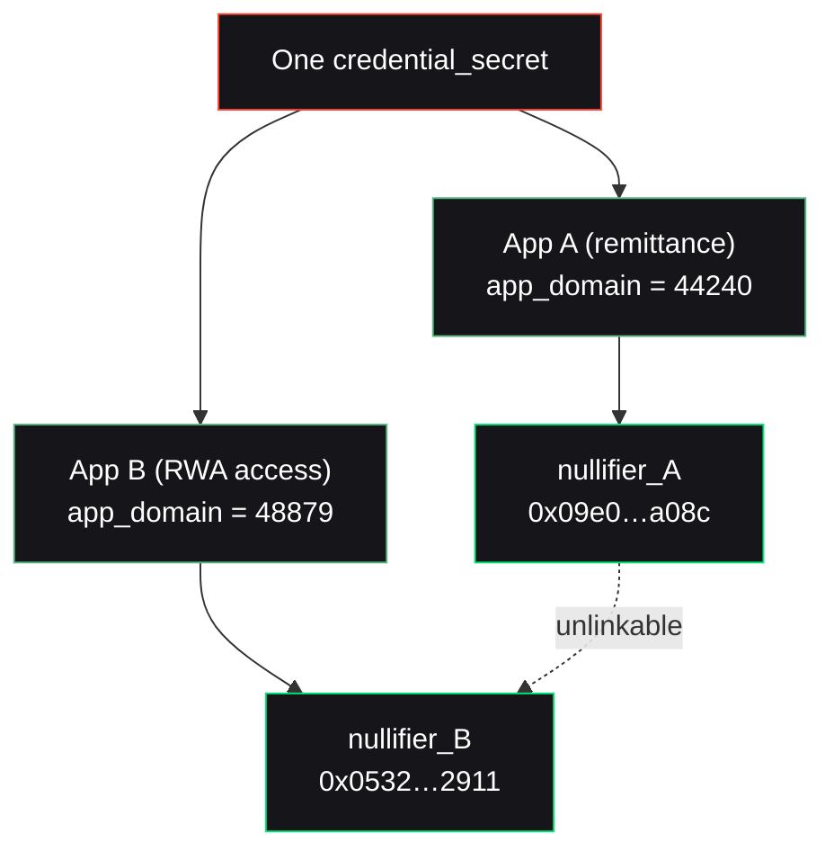

A reusable credential is convenient — and dangerous. If the same credential produced the same on-chain marker everywhere, it would become a tracking beacon: anyone watching the chain could link a user's activity across every app that accepts it.

Nullis keeps credentials reusable **without** making them trackable, by **domain-separating** the nullifier.

## The threat, concretely



If the nullifier were just a function of the secret, the *same* value would surface in every app — a permanent, cross-app identifier. That's the exact tracking harm private credentials are supposed to avoid.

## The mechanism

The nullifier folds in an `app_domain` term:

```txt
nullifier = Poseidon(credential_secret, policy_id, app_domain, action_id)
```

Because Poseidon is a cryptographic hash, changing any input scrambles the output unpredictably. Change the app, change the `app_domain`, and the nullifier is a completely different, uncorrelatable field element — even for the identical credential. Given only two nullifiers, an observer cannot tell whether they came from one credential or two.



<Info>
  The `app_domain` also does double duty for **replay protection**: because it's folded into the nullifier alongside `action_id`, each app maintains its own independent spent-set. A nullifier spent in App A has no bearing on App B.
</Info>

## Proven, not asserted

This is a real, reproducible result — the same credential used in the remittance app and the RWA-access app yields two different nullifiers:

```bash
npm run build -w @nullis/core -w @nullis/sdk -w @nullis/issuer
node examples/unlinkability.mjs
```

| App | Policy | app_domain | Nullifier |
| --- | --- | --- | --- |
| Remittance | 777 | 44240 | `0x09e01e5e…436ba08c` |
| RWA access | 888 | 48879 | `0x0532e4a7…357f2911` |

Same `credentialCommitment`, two unrelated nullifiers. Two apps, one engine, cryptographically unlinkable at the proof and nullifier layer.

## The scope of the claim

<Warning>
  Unlinkability is scoped **precisely**. The same credential yields different nullifiers per app, unlinkable *at the proof and nullifier layer*. It does **not** hide:

  - **Wallet addresses** — the submitting account is public on both apps.
  - **Funding sources** — shared funding can correlate accounts.
  - **IP and timing** — network-level metadata lives outside the artifact layer.

  Nullis never overclaims beyond the artifact layer.
</Warning>

This precision is itself a feature: Nullis tells you exactly where its privacy guarantee ends, so you can reason about the rest of your stack — wallets, RPC, funding — honestly, instead of assuming a blanket "anonymous."

<Card title="Next: revocation" icon="rotate" href="/crypto/revocation">
  How access is revoked without touching anyone's identity.
</Card>
