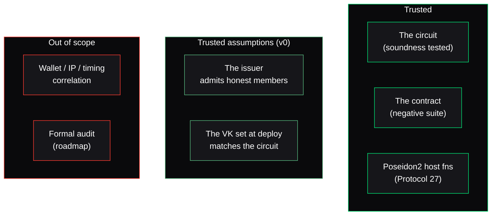

Nullis is a security product, so it states its threat model plainly — including what it does **not** protect.

## What the system guarantees

<CardGroup cols={2}>
  <Card title="No forged eligibility" icon="shield-check">
    You cannot produce a valid proof without a genuine credential secret whose commitment is in the approved root. Enforced by the circuit; verified on-chain.
  </Card>
  <Card title="No replay" icon="ban">
    The nullifier and `action_id` are consumed on-chain. The same proof cannot authorize a second action.
  </Card>
  <Card title="No action substitution" icon="link">
    The proof binds to `context_hash`; the contract recomputes it from the submitted action. Change the recipient, amount, asset, contract, or network and the proof no longer matches.
  </Card>
  <Card title="No stale access" icon="rotate">
    Rotating the approved root and version rejects proofs bound to an old root. Disabled and expired policies reject all execution.
  </Card>
</CardGroup>

## Trust boundaries

## What Nullis does NOT protect against

<Warning>
  Nullis's privacy guarantee is scoped to the **proof and nullifier layer**. It does not hide:

  - **Wallet-address correlation** — the submitting account is public.
  - **Funding-source, IP, and timing** analysis — these live outside the artifact layer.
  - **A malicious issuer** — v0 trusts the reference issuer to admit only approved users. Multi-issuer governance is roadmap.
</Warning>

Stating these limits is deliberate. A privacy claim you can't bound is a privacy claim you can't trust.

## The claim-safety invariant

The core security invariant is the [circuit/contract split](/concepts/claim-safety): privacy-critical statements are proven in zero knowledge; public policy parameters are enforced in the clear. Nullis never attributes a contract check to the circuit or vice versa — in code, docs, or UI. That mismatch is the single easiest thing for a reviewer to reject, so the boundary is held everywhere.

## Roadmap hardening

- In-circuit sparse-Merkle **non-membership** revocation (removes the witness-refresh cost).
- **Multi-issuer governance** (removes the single-issuer trust assumption).
- **Mainnet** deployment and a **formal security audit**.

<Note>
  None of the roadmap items are claimed as shipped. See the [honesty table](/evidence/honesty) for the exact real-vs-roadmap line.
</Note>
